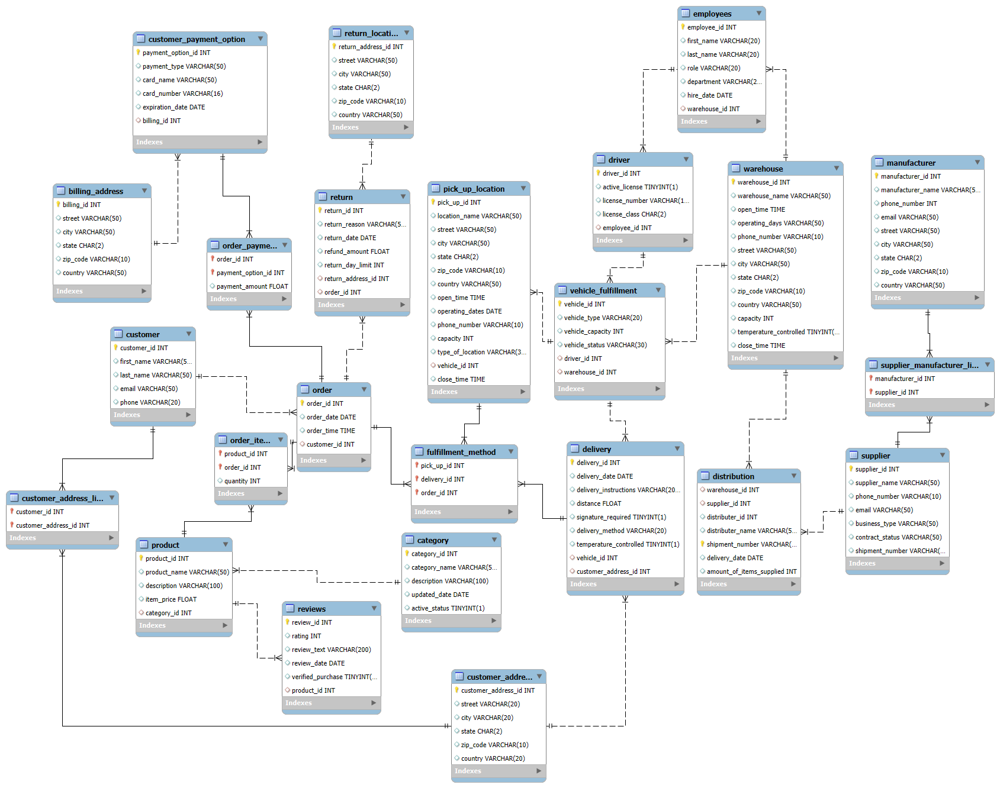

# Commerce-Operations-Database-SQL

End-to-end SQL commerce database simulating real-world operations, including entities such as customers, orders, fulfillment, warehouses, and more. This project includes queries that modify the schema by using DML and DDL, along with basic data analytics queries. 

## Entity Relationship Diagram (ERD)

## How to Run 

1. Run 'schema_and_inserts.sql' to create tables and populate with inserts.
2. Run 'validation_and_queries.sql' to test the schema, validate inserts, demonstrate a DDL/DML deletion query, and use DQL for analysis.
